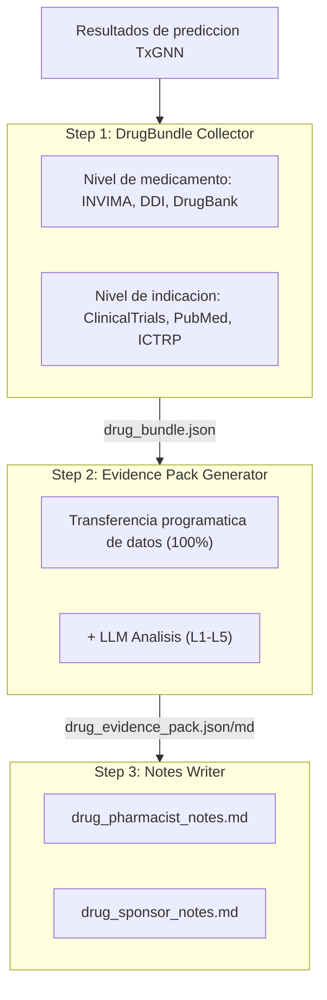
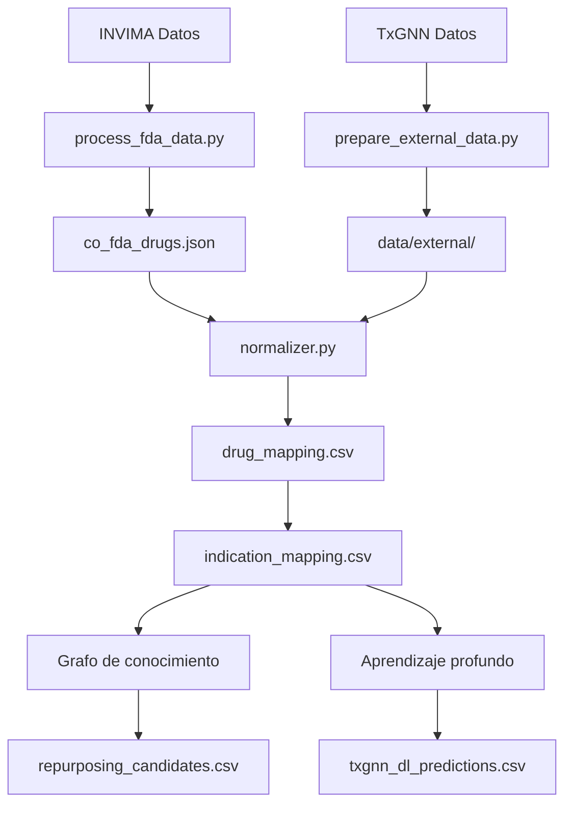

# COTxGNN - Colombia: Reposicionamiento de Medicamentos

[](https://cotxgnn.yao.care)
[](https://opensource.org/licenses/MIT)

Predicciones de reposicionamiento de medicamentos para medicamentos aprobados por INVIMA (Colombia) usando el modelo TxGNN.

## Aviso legal

- Los resultados de este proyecto son solo para fines de investigacion y no constituyen consejo medico.
- Los candidatos a reposicionamiento de medicamentos requieren validacion clinica antes de su aplicacion.

## Vision general del proyecto

### Estadisticas de informes

| Elemento | Cantidad |
|------|------|
| **Informes de medicamentos** | 420 |
| **Predicciones totales** | 73,068,418 |
| **Medicamentos unicos** | 549 |
| **Indicaciones unicas** | 17,041 |
| **Datos DDI** | 302,516 |
| **Datos DFI** | 857 |
| **Datos DHI** | 35 |
| **Datos DDSI** | 8,359 |
| **Recursos FHIR** | 420 MK / 3,100 CUD |

### Distribucion de niveles de evidencia

| Nivel de evidencia | Cantidad de informes | Descripcion |
|---------|-------|------|
| **L1** | 0 | Multiples ECAs de Fase 3 |
| **L2** | 0 | ECA unico o multiples Fase 2 |
| **L3** | 0 | Estudios observacionales |
| **L4** | 0 | Estudios preclinicos / mecanisticos |
| **L5** | 420 | Solo prediccion computacional |

### Por fuente

| Fuente | Predicciones |
|------|------|
| DL | 73,065,318 |
| KG + DL | 2,714 |
| KG | 386 |

### Por confianza

| Confianza | Predicciones |
|------|------|
| very_high | 2,030 |
| high | 3,273,699 |
| medium | 7,135,511 |
| low | 62,657,178 |

---

## Metodos de prediccion

| Metodo | Velocidad | Precision | Requisitos |
|------|------|--------|----------|
| Grafo de conocimiento | Rapido (segundos) | Menor | Sin requisitos especiales |
| Aprendizaje profundo | Lento (horas) | Mayor | Conda + PyTorch + DGL |

### Metodo del grafo de conocimiento

```bash
uv run python scripts/run_kg_prediction.py
```

| Metrica | Valor |
|------|------|
| INVIMA Total de medicamentos | 159,295 |
| Mapeados a DrugBank | 43,021 (27.0%) |
| Candidatos a reposicionamiento | 3,100 |

### Metodo de aprendizaje profundo

```bash
conda activate txgnn
PYTHONPATH=src python -m cotxgnn.predict.txgnn_model
```

| Metrica | Valor |
|------|------|
| Predicciones DL totales | 1,070,520 |
| Medicamentos unicos | 549 |
| Indicaciones unicas | 17,041 |

### Interpretacion de puntuaciones

La puntuacion TxGNN representa la confianza del modelo en un par farmaco-enfermedad, con un rango de 0 a 1.

| Umbral | Significado |
|-----|------|
| >= 0.9 | Confianza muy alta |
| >= 0.7 | Confianza alta |
| >= 0.5 | Confianza moderada |

#### Distribucion de puntuaciones

| Umbral | Significado |
|-----|------|
| ≥ 0.9999 | Confianza extremadamente alta, predicciones mas confiables del modelo |
| ≥ 0.99 | Confianza muy alta, vale la pena priorizar para validacion |
| ≥ 0.9 | Confianza alta |
| ≥ 0.5 | Confianza moderada (frontera de decision sigmoide) |

#### Definiciones de niveles de evidencia

| Nivel | Definicion | Significancia clinica |
|-----|------|---------|
| L1 | ECA de fase 3 o revision sistematica | Puede respaldar el uso clinico |
| L2 | ECA de fase 2 | Puede considerarse para uso |
| L3 | Fase 1 o estudio observacional | Requiere evaluacion adicional |
| L4 | Reporte de caso o investigacion preclinica | Aun no recomendado |
| L5 | Solo prediccion computacional, sin evidencia clinica | Requiere investigacion adicional |

#### Recordatorios importantes

1. **Las puntuaciones altas no garantizan eficacia clinica: las puntuaciones TxGNN son predicciones basadas en grafos de conocimiento que requieren validacion en ensayos clinicos.**
2. **Las puntuaciones bajas no significan ineficacia: el modelo puede no haber aprendido ciertas asociaciones.**
3. **Se recomienda usar con el pipeline de validacion: utilice las herramientas de este proyecto para revisar ensayos clinicos, literatura y otra evidencia.**

### Pipeline de validacion



---

## Inicio rapido

### Paso 1: Descargar datos

| Archivo | Descarga |
|------|------|
| INVIMA Datos | [Código Único de Medicamentos Vigentes](https://datos.gov.co/resource/i7cb-raxc.json) |
| node.csv | [Harvard Dataverse](https://dataverse.harvard.edu/api/access/datafile/7144482) |
| kg.csv | [Harvard Dataverse](https://dataverse.harvard.edu/api/access/datafile/7144484) |
| edges.csv | [Harvard Dataverse](https://dataverse.harvard.edu/api/access/datafile/7144483) |
| model_ckpt.zip | [Google Drive](https://drive.google.com/uc?id=1fxTFkjo2jvmz9k6vesDbCeucQjGRojLj) |

### Paso 2: Instalar dependencias

```bash
uv sync
```

### Paso 3: Procesar datos de medicamentos

```bash
uv run python scripts/process_fda_data.py
```

### Paso 4: Preparar datos de vocabulario

```bash
uv run python scripts/prepare_external_data.py
```

### Paso 5: Ejecutar prediccion del grafo de conocimiento

```bash
uv run python scripts/run_kg_prediction.py
```

### Paso 6: Configurar entorno de aprendizaje profundo

```bash
conda create -n txgnn python=3.11 -y
conda activate txgnn
pip install torch==2.2.2 torchvision==0.17.2
pip install dgl==1.1.3
pip install git+https://github.com/mims-harvard/TxGNN.git
pip install pandas tqdm pyyaml pydantic ogb
```

### Paso 7: Ejecutar prediccion de aprendizaje profundo

```bash
conda activate txgnn
PYTHONPATH=src python -m cotxgnn.predict.txgnn_model
```

---

## Recursos

### TxGNN Nucleo

- [TxGNN Paper](https://www.nature.com/articles/s41591-024-03233-x) - Nature Medicine, 2024
- [TxGNN GitHub](https://github.com/mims-harvard/TxGNN)
- [TxGNN Explorer](http://txgnn.org)

### Fuentes de datos

| Categoria | Datos | Fuente | Nota |
|------|------|------|------|
| **Datos de medicamentos** | INVIMA | [Código Único de Medicamentos Vigentes](https://datos.gov.co/resource/i7cb-raxc.json) | Colombia |
| **Grafo de conocimiento** | TxGNN KG | [Harvard Dataverse](https://dataverse.harvard.edu/dataset.xhtml?persistentId=doi:10.7910/DVN/IXA7BM) | 17,080 diseases, 7,957 drugs |
| **Base de datos de medicamentos** | DrugBank | [DrugBank](https://go.drugbank.com/) | Mapeo de ingredientes de medicamentos |
| **Interacciones medicamentosas** | DDInter 2.0 | [DDInter](https://ddinter2.scbdd.com/) | Pares DDI |
| **Interacciones medicamentosas** | Guide to PHARMACOLOGY | [IUPHAR/BPS](https://www.guidetopharmacology.org/) | Interacciones de medicamentos aprobados |
| **Ensayos clinicos** | ClinicalTrials.gov | [CT.gov API v2](https://clinicaltrials.gov/data-api/api) | Registro de ensayos clinicos |
| **Ensayos clinicos** | WHO ICTRP | [ICTRP API](https://apps.who.int/trialsearch/api/v1/search) | Plataforma internacional de ensayos clinicos |
| **Literatura** | PubMed | [NCBI E-utilities](https://eutils.ncbi.nlm.nih.gov/entrez/eutils/) | Busqueda de literatura medica |
| **Mapeo de nombres** | RxNorm | [RxNav API](https://rxnav.nlm.nih.gov/REST) | Estandarizacion de nombres de medicamentos |
| **Mapeo de nombres** | PubChem | [PUG-REST API](https://pubchem.ncbi.nlm.nih.gov/docs/pug-rest) | Busqueda de sinonimos quimicos |
| **Mapeo de nombres** | ChEMBL | [ChEMBL API](https://www.ebi.ac.uk/chembl/api/data) | Base de datos de bioactividad |
| **Estandares** | FHIR R4 | [HL7 FHIR](http://hl7.org/fhir/) | MedicationKnowledge, ClinicalUseDefinition |
| **Estandares** | SMART on FHIR | [SMART Health IT](https://smarthealthit.org/) | Integracion EHR, OAuth 2.0 + PKCE |

### Descargas de modelos

| Archivo | Descarga | Nota |
|------|------|------|
| Modelo pre-entrenado | [Google Drive](https://drive.google.com/uc?id=1fxTFkjo2jvmz9k6vesDbCeucQjGRojLj) | model_ckpt.zip |
| node.csv | [Harvard Dataverse](https://dataverse.harvard.edu/api/access/datafile/7144482) | Datos de nodos |
| kg.csv | [Harvard Dataverse](https://dataverse.harvard.edu/api/access/datafile/7144484) | Datos del grafo de conocimiento |
| edges.csv | [Harvard Dataverse](https://dataverse.harvard.edu/api/access/datafile/7144483) | Datos de aristas (DL) |

## Introduccion al proyecto

### Estructura de directorios

```
COTxGNN/
├── README.md
├── CLAUDE.md
├── pyproject.toml
│
├── config/
│   └── fields.yaml
│
├── data/
│   ├── kg.csv
│   ├── node.csv
│   ├── edges.csv
│   ├── raw/
│   ├── external/
│   ├── processed/
│   │   ├── drug_mapping.csv
│   │   ├── repurposing_candidates.csv
│   │   ├── txgnn_dl_predictions.csv.gz
│   │   └── integration_stats.json
│   ├── bundles/
│   └── collected/
│
├── src/cotxgnn/
│   ├── data/
│   │   └── loader.py
│   ├── mapping/
│   │   ├── normalizer.py
│   │   ├── drugbank_mapper.py
│   │   └── disease_mapper.py
│   ├── predict/
│   │   ├── repurposing.py
│   │   └── txgnn_model.py
│   ├── collectors/
│   └── paths.py
│
├── scripts/
│   ├── process_fda_data.py
│   ├── prepare_external_data.py
│   ├── run_kg_prediction.py
│   └── integrate_predictions.py
│
├── docs/
│   ├── _drugs/
│   ├── fhir/
│   │   ├── MedicationKnowledge/
│   │   └── ClinicalUseDefinition/
│   └── smart/
│
├── model_ckpt/
└── tests/
```

**Leyenda**: 🔵 Desarrollo del proyecto | 🟢 Datos locales | 🟡 Datos TxGNN | 🟠 Pipeline de validacion

### Flujo de datos



---

## Citacion

Si utiliza este conjunto de datos o software, por favor cite:

```bibtex
@software{cotxgnn2026,
  author       = {Yao.Care},
  title        = {COTxGNN: Drug Repurposing Validation Reports for Colombia INVIMA Drugs},
  year         = 2026,
  publisher    = {GitHub},
  url          = {https://github.com/yao-care/COTxGNN}
}
```

Cite tambien el articulo original de TxGNN:

```bibtex
@article{huang2023txgnn,
  title={A foundation model for clinician-centered drug repurposing},
  author={Huang, Kexin and Chandak, Payal and Wang, Qianwen and Haber, Shreyas and Zitnik, Marinka},
  journal={Nature Medicine},
  year={2023},
  doi={10.1038/s41591-023-02233-x}
}
```
